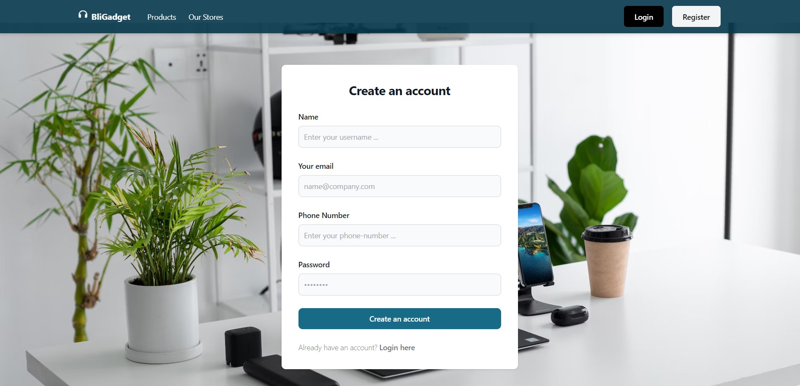
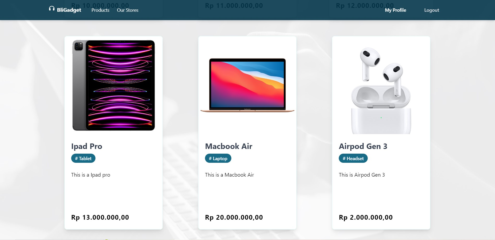
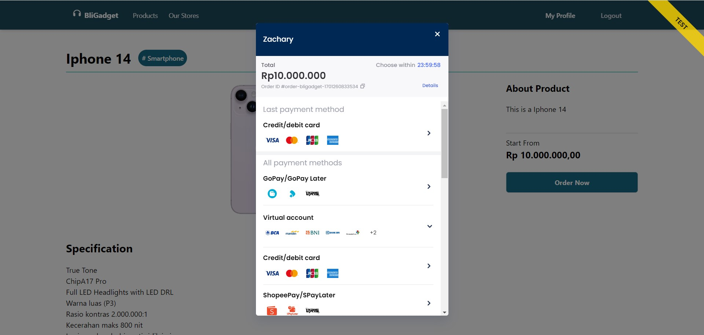
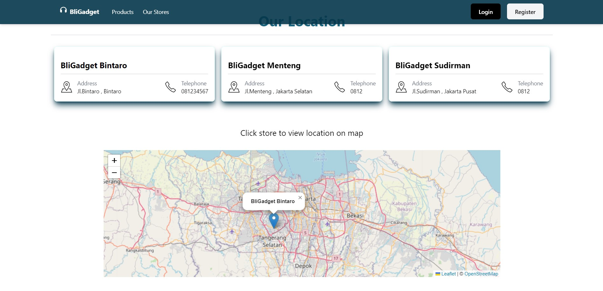

# BliGadget

A Gadget E-Commerce where user can:

- Login and register
- See gadget collections & see gadget detail
- Buy gadget
- Leave a review after their transaction is completed

Tech Stack Used:

- Front-end: VueJs, Pinia, HTML,CSS, Tailwind
- Back-end: ExpressJs, Sequelize, GoogleAuth, NodeJS, PostgreSQL
- Deployment: AWS, Firebase

API Used:

- Payment Gateway (Midtrans)
- Youtube API : to give extra information of the gadget
- Nodemailer : to notify user when a transaction is successful
- Leaflet : to show store location on map

# Project Snippet:

Log-in:

Homepage:

Payment:

Check store location:

